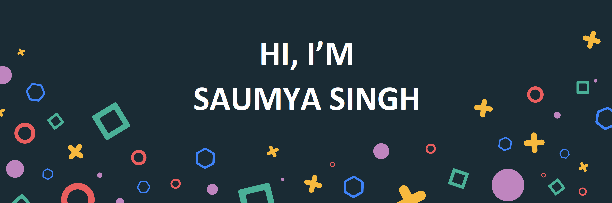

<h2>💻About Me</h2>
👩‍🎓 Hey! I'm Saumya, currently in my pre-final year pursuing B.Tech in CSE.

💖 I’m extremely passionate about web-development.

👩‍💻 Nowadays, I’m learning MERN stack and also focusing on DSA. 

🔥  I’m an Open-Source enthusiast & I enjoy learning new things.
  

## 🛠 &nbsp;Tech Stack

- 💻 &nbsp;
  
  
  
- 🌐 &nbsp;
  
  
  
  
  
- 🛢 &nbsp;
  
- ⚙️ &nbsp;
  
  
- 🔧 &nbsp;
  

 

   
    
    
   ](https://git.io/streak-stats)
    

